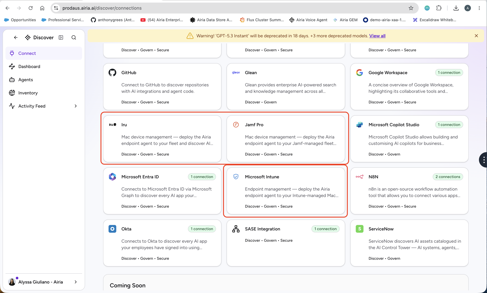
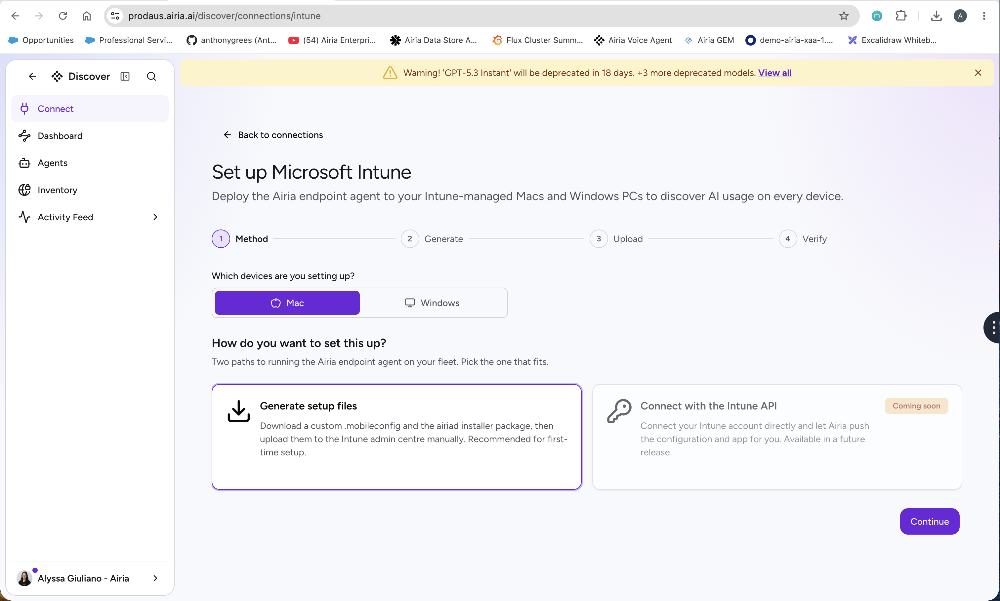
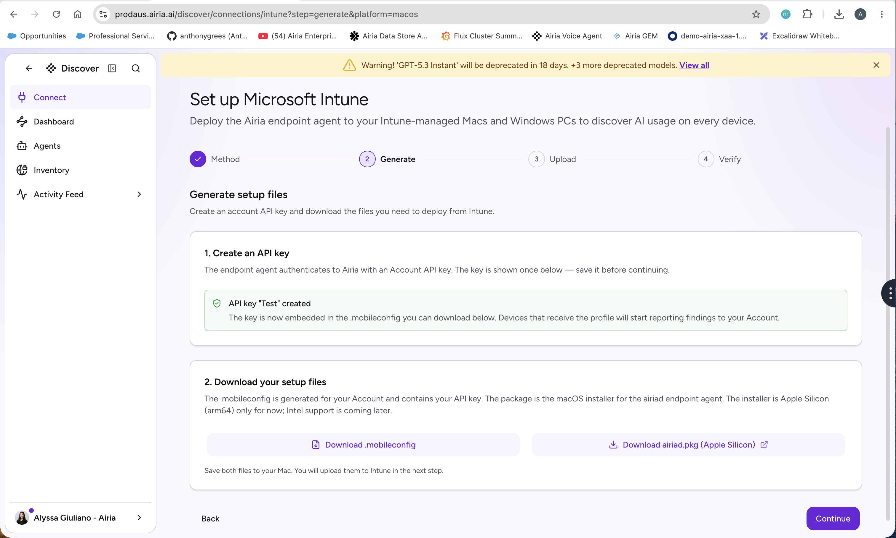

# AI Discovery App - Sideloading & Testing the Agent (no MDM)

**Audience:** anyone who wants to evaluate the airiad endpoint agent on a single Mac **without an MDM**. You will download the exact same artifacts an admin would push through Kandji/Intune/Jamf - the signed agent installer (`.pkg`) and the tenant's configuration profile (`.mobileconfig`) - but instead of uploading them to an MDM, you install them directly on a test laptop and confirm it reports into the tenant that generated them.

> **Why this works.** The agent is enrolled entirely by a managed-preferences configuration profile - it reads `BackendUrl` and `ApiKey` from `/Library/Managed Preferences/com.airia.airiad.plist` and auto-enrolls. A configuration profile installed by hand (device scope) populates that same path exactly like an MDM-delivered one. So "sideloading" is just the admin flow with a local install step swapped in for the MDM upload - no code, no special build, same artifacts, same tenant.

## Table of contents

- [Prerequisites](#prerequisites)
- [Step 1 - Download the artifacts from the platform UI](#step-1---download-the-artifacts-from-the-platform-ui)
- [Step 2 - Install the agent (.pkg)](#step-2---install-the-agent-pkg)
- [Step 3 - Install the configuration profile (.mobileconfig)](#step-3---install-the-configuration-profile-mobileconfig)
- [Step 4 - Enroll (automatic) and force an immediate check-in](#step-4---enroll-automatic-and-force-an-immediate-check-in)
- [Step 5 - Verify it's reporting into the tenant](#step-5---verify-its-reporting-into-the-tenant)
- [Optional - test policy enforcement (AI Gateway rewrite)](#optional---test-policy-enforcement-ai-gateway-rewrite)
- [Gotchas](#gotchas)
- [Cleanup / uninstall](#cleanup--uninstall)

## Prerequisites

- A test **Mac** you have **admin** rights on (installing a pkg and a device profile both require admin auth). Use a scratch / non-critical machine - the agent will rewrite AI-client configs if you test enforce mode.
- Access to the **Airia platform UI** for the target tenant, with permission to run the endpoint-agent MDM wizard on the Integrations page.
- The tenant should already have devices able to report (i.e. the agent feature is enabled for it).

## Step 1 - Download the artifacts from the platform UI

This is identical to what an admin does before pushing to an MDM; you just stop at "download."

1. In the platform, go to **Integrations** and open the **endpoint agent / MDM** wizard for your platform (Kandji, Intune, or Jamf).

   

2. Select **macOS** and walk the wizard for the target tenant. It produces two artifacts - download both:
   - the **agent installer**: `airiad.pkg` (signed + notarized by Airia, so Gatekeeper accepts it), and
   - the **macOS configuration profile**: a `.mobileconfig` that carries this tenant's `BackendUrl` + `ApiKey` as managed preferences.

   

   

> **Note:** The `.mobileconfig` contains a tenant-scoped API key. Treat the file as a secret; don't commit it or share it broadly. It only grants the agent's scopes (findings ingest + policy fetch) for that one tenant.

## Step 2 - Install the agent (.pkg)

Double-click `airiad.pkg` and follow the installer, or from Terminal:

```bash
sudo installer -pkg ~/Downloads/airiad.pkg -target /
```

The package installs:

- `/usr/local/bin/airiad` - the agent binary
- `/usr/local/share/airiad/definitions/` - the AI-client scan definitions
- `/Library/LaunchAgents/com.airia.airiad.plist` - the per-user LaunchAgent (runs `airiad watch`)

The installer's postinstall step starts the LaunchAgent. At this point the agent is running but **not yet enrolled** - it has no backend to talk to until the profile lands in Step 3.

## Step 3 - Install the configuration profile (.mobileconfig)

This is the step that, in production, the MDM does for you. By hand:

1. **Double-click** the `.mobileconfig`. macOS downloads it as a profile awaiting approval.
2. Open **System Settings -> General -> Device Management** (on older macOS: **Privacy & Security -> Profiles**).
3. Select the **Airia airiad - Managed Preferences** profile and click **Install**; authenticate as an admin.

Installing it writes the tenant's values to `/Library/Managed Preferences/com.airia.airiad.plist`. Confirm:

```bash
plutil -p "/Library/Managed Preferences/com.airia.airiad.plist"
# expect:
#   "BackendUrl" => "https://<tenant>.api.airia.ai"
#   "ApiKey"     => "ak-..."
```

## Step 4 - Enroll (automatic) and force an immediate check-in

On its next launch the agent's `ManagedPrefsReader` reads those values and writes `~/.airiad/enrollment.json` - no `airiad enroll` needed. To trigger it immediately rather than waiting for the agent's cadence, restart the LaunchAgent:

```bash
launchctl kickstart -k gui/$(id -u)/com.airia.airiad

# confirm it enrolled to the right tenant:
cat ~/.airiad/enrollment.json
# -> "backend_url": "https://<tenant>.api.airia.ai", "api_key": "ak-..."
```

> **Note:** If you ever swap the profile for a different tenant's, the agent re-bootstraps to the new `BackendUrl`/`ApiKey` automatically (on restart, or within its periodic managed-prefs recheck). A restart via `kickstart` makes the switch immediate.

## Step 5 - Verify it's reporting into the tenant

**On the device** - run a one-shot report and check it posted. `reconcile` fetches the tenant policy and posts a findings report; `--dry-run` avoids changing any AI-client configs:

```bash
airiad reconcile --dry-run --definitions-dir /usr/local/share/airiad/definitions

# success signal: the outbox is empty (failed posts get queued there)
ls ~/.airiad/outbox/ | wc -l        # 0 = the report posted OK

# and confirm the platform handshake / policy fetch directly:
airiad policy --verbose             # expect "<- 200 OK" and the tenant's policy revision
```

**On the platform** - within a minute the device should appear in the tenant's **Security Posture Management** dashboard (endpoints / locally-detected AI assets), showing the AI clients and MCP servers the agent discovered. (API equivalent: `GET /v1/security/endpoints` with a tenant `ak-` key lists reporting devices and their last-seen time.)

## Optional - test policy enforcement (AI Gateway rewrite)

If you want to see the agent actually rewrite a client config, author an `enforce` policy for the tenant, then on the laptop:

```bash
launchctl kickstart -k gui/$(id -u)/com.airia.airiad   # fetch the enforce policy + reconcile

# confirm the rewrite landed in Claude Code's config:
python3 -c 'import json,os;print(json.load(open(os.path.expanduser("~/.claude/settings.json"))).get("env",{}))'
# -> ANTHROPIC_BASE_URL + ANTHROPIC_CUSTOM_HEADERS (x-airia-key: agk-...)
```

Restart Claude Code afterwards so it re-reads the env vars and routes through the gateway.

## Gotchas

- **Local-network backends need a one-time permission.** If your tenant's `BackendUrl` is a **cloud** host (`*.api.airia.ai`), skip this. If you are testing against an **on-prem / local-subnet** backend, macOS Local Network Privacy blocks the agent's first local connection: you'll see `No route to host` in the logs even though `curl`/`ping` work. macOS shows a one-time "AiriaD would like to access local network resources" prompt the first time the agent (running in your GUI session) posts to a local address - click **Allow**, or enable **AiriaD** under **System Settings -> Privacy & Security -> Local Network**. (For fleet on-prem installs, pre-grant via an MDM PPPC profile.)
- **"Posted OK" is signalled by an empty outbox.** The agent is silent on a successful post; a failed post is queued under `~/.airiad/outbox/`. `ls ~/.airiad/outbox/ | wc -l` = `0` means success.
- **`scan` does not talk to the platform.** Use `reconcile` or `watch` to fetch policy and post findings; `scan` is local-only.
- **The backend URL is the API host, not the web app.** e.g. `demo.api.airia.ai`, not `demo.airia.ai` (the latter is the SPA and returns HTML). The wizard-generated profile already uses the correct host.
- **Disabling a policy does not auto-revert a device.** If you tested enforce, flipping the tenant back to `observe` stops future rewrites but leaves the env vars already written. Clean up with the steps below.

## Cleanup / uninstall

1. **Remove the configuration profile:** System Settings -> General -> Device Management -> select the Airia profile -> **Remove** (admin auth). This deletes the managed-prefs file; the agent will no longer be enrolled.
2. **Stop the agent:** `launchctl bootout gui/$(id -u)/com.airia.airiad`.
3. **Revert AI-client configs + wipe agent state:** manually undo any base-URL/custom-header overrides the agent wrote into your AI client's config (whichever client you tested enforce mode against), restart that client, and clear `~/.airiad/`.
4. **Remove the binary (optional):** `sudo rm -rf /usr/local/bin/airiad /usr/local/share/airiad /Library/LaunchAgents/com.airia.airiad.plist`.
